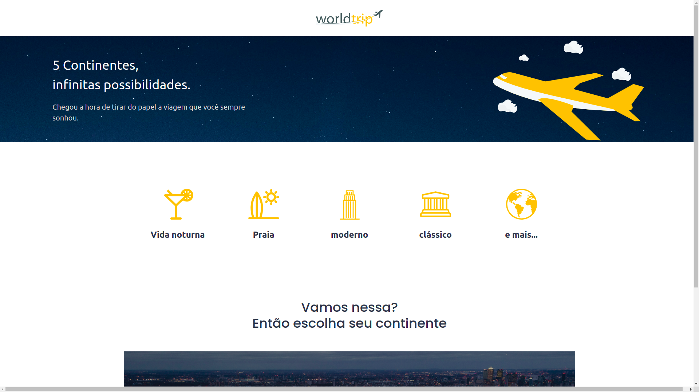
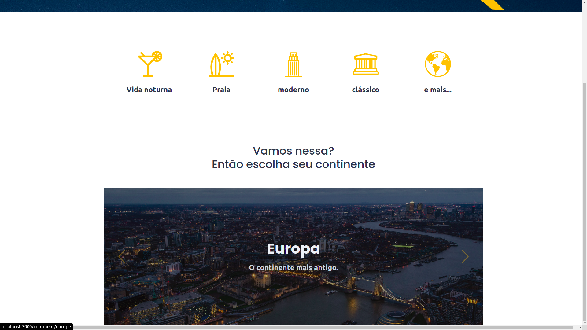
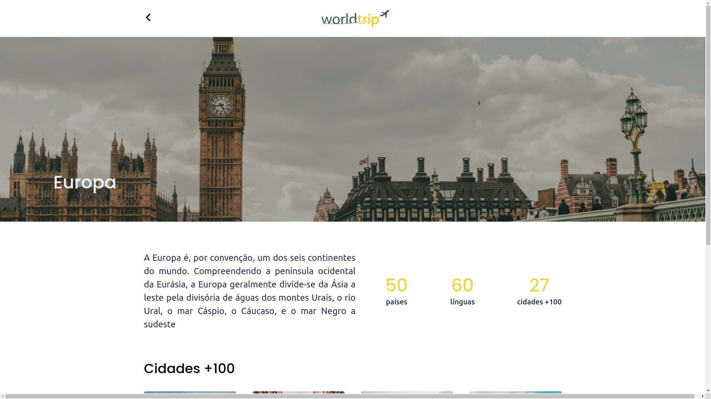

<h1 align="center">
  <strong>World Trip - Desafio Ignite Rocketseat</strong>
</h1>
<br>

## Sobre o projeto - About the project

Este app é um desafio realizado durante o Ignite da Rocketseat. O desafio erá implementar uma interface a partir de layout no figma utilizando apenas ChakraUi.

This app is a challenge held during Rocketseat's Ignite. The challenge will be to implement an interface from a layout in figma using only ChakraUi.

<h1 align="center" display="flex">
   
</h1>
<h1 align="center" display="flex">
   
</h1>
<h1 align="center" display="flex">
   
</h1>
<h1 align="center" display="flex">
   
</h1>

## :computer: Tecnologias - Technologies

Este projeto foi desenvolvido com as seguintes tecnologias:
<br>
This project was developed with the following technologies:

- [Next](https://nextjs.org/)
- [TypeScript](https://www.typescriptlang.org/)
- [ChakraUI](https://chakra-ui.com/)
- [Swiper](https://swiperjs.com/)

<br>

## Como executar - How to execute

Para iniciá-lo, siga as etapas abaixo:
<br>
To start it, follow the steps below:

```bash
# Instale as dependencias
# Install dependencies
$ yarn

# Inicie o projeto
# start the project
$ yarn dev
```

O aplicativo estará disponível em seu navegador no endereço http://localhost:3000.
<br>
The app will be available in your browser at the address http://localhost:3000.
<br>
